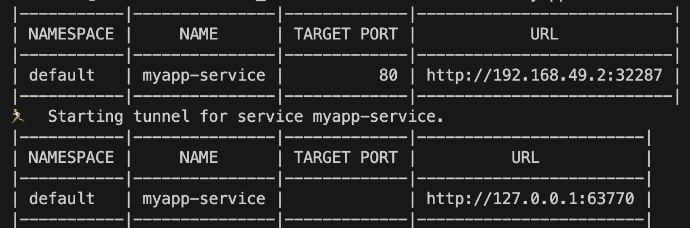
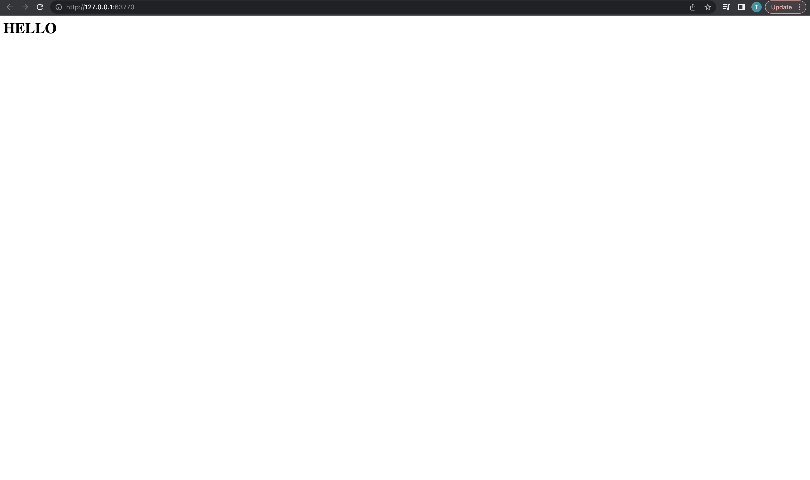

# Webserver_datenna

## Creator

[@Duc Thanh Do]()

## Requirements

We want you to create a webserver that serves a simple web page.

+ The first time it is accessed it shows the string “Hello” and the next time “World” and then flips between them each time it is visited.
+ The service/setup you create should be able to be hosted locally or on Kubernetes.
+ It should be easy for someone to delete and re-create it as needed.
+ Please provide a link/GIT repo where your code can be downloaded.

## Explanation

**Application**
 
Every time the page is visited, or reloaded, the function will read the file word.txt (by default with only one word HELLO).
The function will then replace the current word in the .txt, for instance from HELLO to WORLD.
Finally, it prints the word in HTML.

**Deployment**

Two .yaml files to deploy the application, with the docker image on my public dockerhub repository.

## Steps to deploy

**Dockerizing with Rancher-Desktop**

For now, I am using my company docker image, it is the same as the image in Dockerhub. To build the Dockerfile, update the file:
	
	FROM python:3.10-alpine3.13

Add the following allowed image source (only for Rancher-Desktop users):
	
	registry-1.docker.io/td24/

Build and run:
	
	docker build -t td24/datenna .
	docker run -it -p 8080:80 --name webserver td24/datenna
After that, access the application at port 8080 (localhost:8080).

Push to Dockerhub:
	
	docker login
	docker push td24/datenna

**The application is deployed with minikube**
	
	minikube start
	kubectl apply -f deployment.yaml
	kubectl apply -f service.yaml
	minikube service myapp-service
	